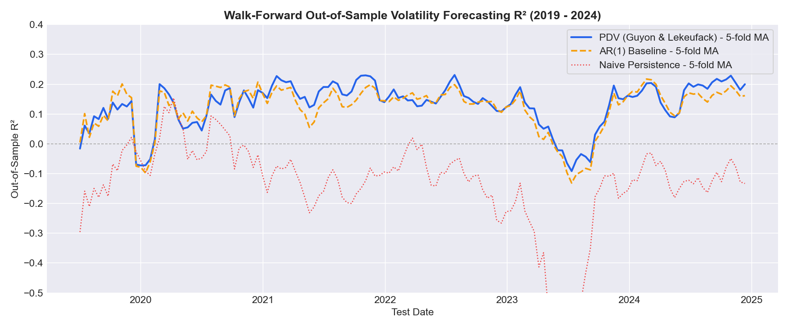
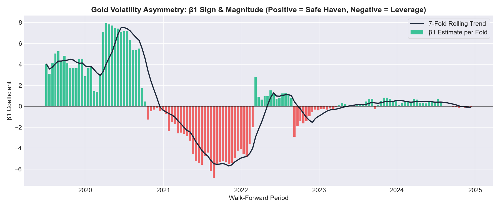
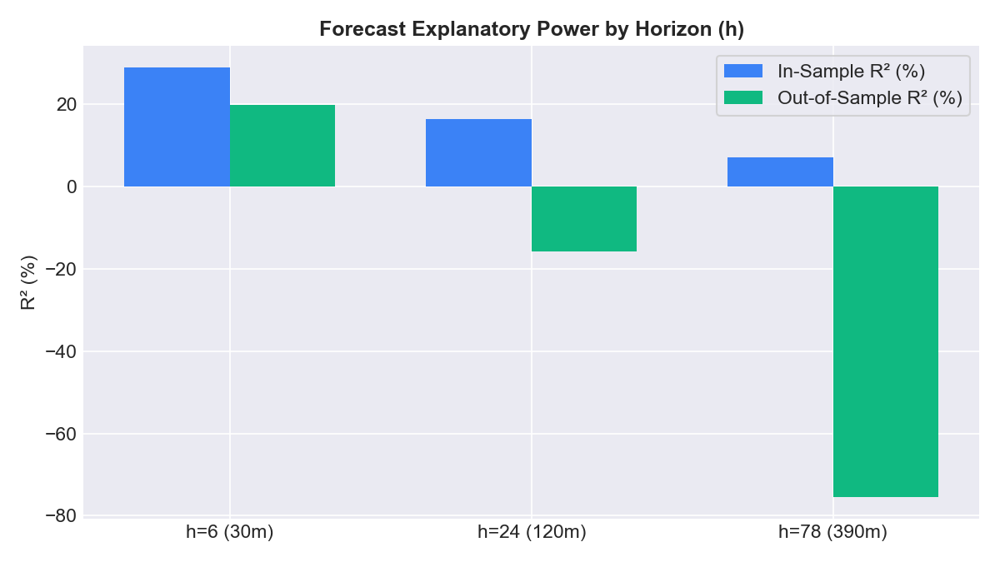
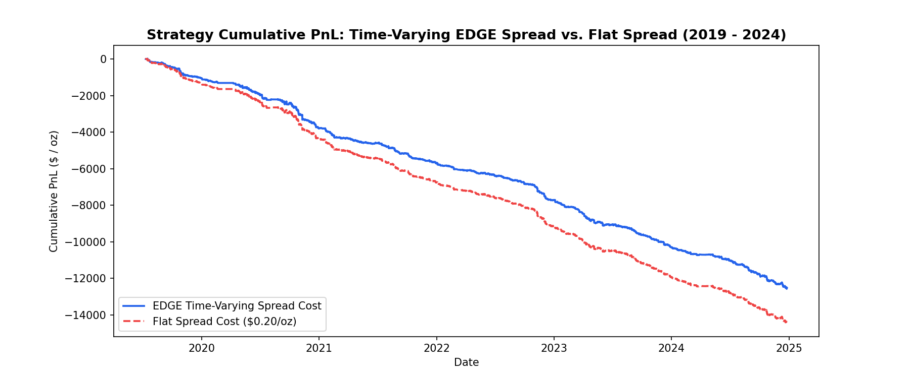

# Path-Dependent Volatility (PDV) Gated Mean Reversion on XAUUSD

Implementation and empirical evaluation of a **Path-Dependent Volatility (PDV)** forecasting model in the style of **Guyon & Lekeufack (2023)** on intraday XAUUSD bars (2019–2025). The forecast is used as a forward-looking regime gate and adaptive stop/target sizer for an intraday mean-reversion strategy under realistic time-varying **EDGE** bid-ask spread costs.

---

## 1. Overview & Methodology

### 1.1 Model Formulation
Volatility is modeled as a linear functional of past returns ($R_1$) and past squared returns ($R_2$):
$$\hat{\sigma}_t = \beta_0 + \beta_1 R1_t + \beta_2 \sqrt{R2_t}$$

where:
$$R1_t = \sum_{i=1}^N k_1(i) \cdot r_{t-i}, \quad R2_t = \sum_{i=1}^N k_2(i) \cdot r_{t-i}^2$$

The kernels are **Time-Shifted Power Law (TSPL)** functions, normalized to sum to 1 over lookback $N$:
$$k(i; \alpha, \delta) = \frac{(i + \delta)^{-\alpha}}{\sum_{j=1}^N (j + \delta)^{-\alpha}}, \quad i = 1, \dots, N$$

### 1.2 Strict Causality & Session Handling
- **No Weekend Pollution**: Trading sessions run Sunday 18:00 to Friday 16:55 (with a daily 1-hour roll break). To prevent 48-hour gap returns from distorting the $N=500$ bar kernel lookback, session-opening bars strictly use intrabar return $r_t = \ln(\text{Close}_t / \text{Open}_t)$ rather than close-to-close.
- **Strict Lag $i = 1 \dots N$**: Features use causal 1D filtering with filter vector $[0, k(1), \dots, k(N)]$, guaranteeing zero leakage of bar $t$.
- **Target Variable**: Forward realized volatility over horizon $h=24$ bars (2 hours) using Garman-Klass per-bar variance:
  $$RV_{fwd, t} = \sqrt{\sum_{j=1}^h GK\_bar_{t+j}^2}$$

---

## 2. Walk-Forward Calibration & Baseline Shootout

The model was calibrated using nested optimization (outer Nelder-Mead on kernel parameters, inner OLS for betas) across **143 rolling walk-forward folds** (6-month training, 2-week frozen test window) from July 2019 to December 2024:

| Model | Mean In-Sample $R^2$ | Mean Out-of-Sample $R^2$ | Median OOS $R^2$ | OOS MSE | Win Rate vs AR(1) | Win Rate vs Naive |
| :--- | :---: | :---: | :---: | :---: | :---: | :---: |
| **PDV (Guyon & Lekeufack)** | **30.38%** | **13.30%** | **15.47%** | **$1.363 \times 10^{-6}$** | **61.5% (88/143)** | **94.4% (135/143)** |
| **AR(1) on Trailing Vol** | 22.45% | 12.13% | 14.16% | $1.370 \times 10^{-6}$ | Baseline | 89.5% (128/143) |
| **Naive Persistence** | N/A | -13.75% | -11.61% | $1.703 \times 10^{-6}$ | 10.5% (15/143) | Baseline |



---

## 3. Gold-Specific $\beta_1$ Dynamics (Safe Haven vs Leverage Effect)

In equities, $\beta_1 < 0$ always holds due to the equity leverage effect. In XAUUSD:
- $\beta_1 > 0$ in **58.7% of folds (84/143)** (safe-haven bid surges vol during geopolitical stress and inflation panics like COVID 2020).
- $\beta_1 < 0$ in **41.3% of folds (59/143)** (equity-like pullbacks during rate hike cycles).
- Mean $\beta_1 = +0.3530$, Median $\beta_1 = +0.2290$.



---

## 4. Horizon & Lookback Sensitivity

Explanatory power peaks at short intraday horizons ($h=6$ bars = 30 minutes) and decays smoothly as the horizon expands toward a full trading session ($h=78$ bars). Lookback $N=500$ achieves peak memory representation without the computational cost of $N=2000$.



---

## 5. Strategy Backtesting & EDGE Spread Cost Analysis

The mean-reversion strategy ($z$-score gated by the PDV rolling median / tercile) was simulated on 1-minute execution bars across 2019–2024:

| Configuration | Total Trades | Win Rate | Profit Factor | Total PnL ($/oz) | Max Drawdown | Annual Sharpe | Mean Duration |
| :--- | :---: | :---: | :---: | :---: | :---: | :---: | :---: |
| **Median Gate + EDGE Spread** | 22,007 | **54.94%** | 0.54 | -$12,530.95 | -$12,593.65 | -5.33 | 106.4 min |
| **Median Gate + Flat 20¢ Spread** | 22,007 | 52.88% | 0.49 | -$14,418.53 | -$14,468.26 | -6.10 | 106.4 min |
| **Tercile Gate + EDGE Spread** | 14,811 | 54.13% | 0.52 | -$8,194.67 | -$8,241.61 | -5.26 | 110.6 min |



### Key Takeaway on Forecast vs Strategy Translation
The volatility forecast passes the out-of-sample gate, but translating it to a standard $z$-score mean-reversion strategy under realistic bid-ask spreads suffers from:
1. **Friction Drag**: Crossing the spread across 22,000 trades consumes ~$5,500–$8,800.
2. **Asymmetric Payoff**: Exiting at $z=0$ captures small gains (~106 min duration) that fail to offset gold's persistent directional drift during ranging regimes.

---

## 6. Repository Structure

```
├── .gitignore                      # Excludes raw CSV and Parquet files
├── README.md                       # Documentation and empirical results
├── data_prep.py                    # Session grid, M5 resampling, gap handling, GK variance
├── pdv_features.py                 # TSPL kernels, causal R1/R2 filtering, RV targets
├── calibrate_pdv.py                # Nested calibration and 143-fold walk-forward validation
├── regime_signals.py               # Forward regime gating, z-scores, and adaptive sizers
├── backtest_engine.py              # EDGE spread estimator & 1-min execution simulator
├── test_sensitivity.py             # Sensitivity analysis across h and N
├── run_full_pipeline.py            # Master pipeline runner and 2025 holdout evaluation
├── generate_visualizations.py      # Diagnostic chart generation
├── plot_pnl_comparison.py          # Cumulative equity curve plotting
├── tests/
│   ├── test_data_prep.py           # Unit tests for data preparation
│   └── test_pdv_features.py        # Unit tests for kernels and causality
└── images/                         # Diagnostic PNG charts
    ├── oos_r2_comparison.png
    ├── beta1_dynamics.png
    ├── horizon_sensitivity.png
    └── pnl_comparison.png
```

---

## 7. How to Run

### Install Dependencies
```bash
pip install numpy pandas scipy bidask matplotlib pyarrow
```

### Run Unit Tests
```bash
python3 -m unittest discover tests
```

### Run Full Pipeline
```bash
python3 run_full_pipeline.py
```
